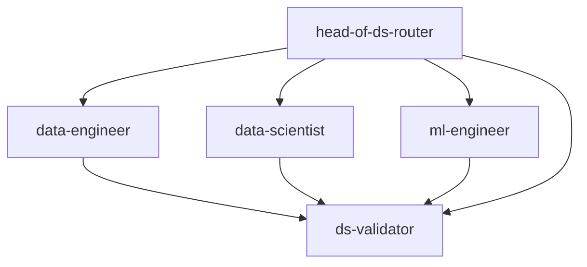

# Data Science Agent Team Contracts

## Overview

This document defines the contracts and working agreements between our Data Science agents. Each agent has specific responsibilities, decision rights, and handoff protocols that ensure cohesive, validated DS workflows.

## Team Environment Standards

### 🔒 **MANDATORY: Python Virtual Environment Usage**

**All DS team agents must use Python virtual environments (.venv) for every operation.** This is non-negotiable for data science work quality and reproducibility.

**Why Virtual Environments are Critical for DS:**
- **Dependency Lock**: Data science libraries (pandas, scikit-learn, numpy) have complex version dependencies. Different versions can produce different model outputs.
- **Reproducibility**: Experiments must be reproducible across team members and deployment environments.
- **Production Safety**: Model serving requires exact same library versions as training environment.
- **Pipeline Reliability**: Data pipelines can fail silently with wrong package versions.
- **Isolation**: Prevents system Python pollution that affects other projects.

**Implementation:**
```bash
# Before any DS work
python -m venv .venv
source .venv/bin/activate  # Linux/Mac
# .venv\Scripts\activate   # Windows

# Install dependencies
pip install -r requirements.txt

# Verify environment
pip list
```

**Every agent handoff must include environment documentation (requirements.txt/pyproject.toml).**

## Team Structure



## Agent Roles & Responsibilities

### 🎯 **head-of-ds-router**
**Primary Function**: DS workflow orchestrator with decision rights

**Decision Rights**:
- Project scope and complexity assessment
- Success metrics and Definition of Done
- Risk tolerance and validation requirements  
- Resource allocation and timeline approval

**Key Responsibilities**:
- Decompose DS queries into specialist tasks
- Manage planning files and sequential execution
- Coordinate agent handoffs and consolidate responses
- Enforce interface contracts between DE→DS→MLE

**Handoffs TO**:
- `ds-validator`: Plan validation, output validation, production readiness
- `data-engineer`: Data pipeline specifications
- `data-scientist`: Analytical requirements 
- `ml-engineer`: Production implementation

### 🔧 **data-engineer**
**Primary Function**: Data pipeline specialist with quality contracts

**Key Responsibilities**:
- Design and implement data transformations
- Establish input/output data contracts with schema validation
- Ensure pipeline idempotency and quality monitoring
- Maintain >95% data quality pass rate

**Interface Contracts**:
```python
# TO data-scientist
{
  "contract": "feature_store_output",
  "schema": "features/*.parquet", 
  "quality": ">95% DQ checks",
  "sla": "<2h refresh"
}

# TO ml-engineer  
{
  "contract": "training_data_output",
  "schema": "train/*.parquet",
  "quality": "no missing targets",
  "sla": "daily refresh"
}
```

**Handoffs TO**:
- `data-scientist`: Feature engineering pipelines
- `ml-engineer`: Training data delivery
- `ds-validator`: Data pipeline validation, data contract validation

### 📊 **data-scientist**
**Primary Function**: Modeling and analytics specialist with evaluation rigor

**Key Responsibilities**:
- Exploratory data analysis and feature engineering
- Model development with proper train/validation/test splits
- Establish baselines and evaluation protocols
- Statistical inference and causal analysis

**Deliverable Standards**:
- **Baseline**: Always establish simple heuristic baseline
- **Evaluation**: Proper temporal/grouped CV with business metrics
- **Features**: Document feature engineering with leakage risk assessment
- **Analysis**: Statistical significance testing and confidence intervals

**Handoffs TO**:
- `data-engineer`: Data pipeline requirements
- `ml-engineer`: Model specifications for production
- `ds-validator`: Analysis validation, feature engineering validation

### ⚙️ **ml-engineer**
**Primary Function**: Production ML specialist with reliability requirements

**Key Responsibilities**:
- Model training pipeline automation (reproducible <1% variance)
- Serving infrastructure with monitoring and alerting
- CI/CD for ML with automated testing and rollback
- Production model registry and version management

**Production Standards**:
- **Reproducibility**: <1% variance across training runs
- **Monitoring**: Model drift, performance degradation, infrastructure
- **Testing**: Unit tests for transforms, integration tests for pipelines
- **Deployment**: Blue-green with automated rollback on performance drop

**Handoffs TO**:
- `data-scientist`: Model validation review
- `data-engineer`: Data pipeline integration
- `ds-validator`: ML pipeline validation, production system validation

### ✅ **ds-validator**
**Primary Function**: DS-specific validation with leakage detection

**Key Responsibilities**: 
- DS methodology validation (proper CV, baseline comparison)
- Data leakage detection and feature engineering review
- Reproducibility verification and testing standards
- Production readiness assessment for DS deliverables

**Validation Checkpoints**:
- **Planning**: Dependencies, metrics, risk assessment
- **Analysis**: Statistical methods, interpretation rigor  
- **Features**: Leakage risks, temporal alignment
- **Pipelines**: Reproducibility, data quality, idempotency
- **Production**: Monitoring, testing, rollback procedures

## Workflow Contracts

### 1. **Planning Phase Contract**
- Router creates planning file using `ds-planning-workflows` skill
- Each agent reviews relevant sections and provides input
- ds-validator validates overall structure and dependencies
- Router consolidates into final approved plan

### 2. **Execution Phase Contract**
- Agents execute tasks according to approved plan sequence 
- Each deliverable includes validation handoff to ds-validator
- No downstream work proceeds without validation approval
- Router coordinates handoffs and consolidates progress

### 3. **Quality Gates Contract**
- **Gate 1 (Analysis)**: Statistical rigor, baseline establishment
- **Gate 2 (Engineering)**: Pipeline quality, no leakage, reproducibility
- **Gate 3 (Production)**: Monitoring, testing, deployment readiness

## Communication Protocols

### **Agent-to-Agent Handoffs**
```yaml
# Standard handoff format
- label: 'Descriptive Action Name'
  agent: 'target-agent'
  prompt: 'Specific task description with context and requirements'
  send: false  # Agent handles coordination
```

### **Validation Requests**
- Include specific validation checklist in prompt
- Provide relevant artifacts (code, data, analysis)
- Specify acceptance criteria and success metrics
- Document any exceptions or special considerations

### **Progress Reporting**
- Router maintains central planning file with status
- Agents update progress in structured format
- Blockers and dependencies tracked with clear ownership
- Regular checkpoint reviews at quality gates

## Exception Handling

### **Non-Negotiable Requirements** 
🔒 **Virtual Environment Usage**: NO exceptions under any circumstances. Even 5-minute tasks, bug fixes, or emergency production issues must use virtual environments. System Python is forbidden for all DS work.

### **Fast-Lane Exceptions** (Router Decision Rights)
1. **Exploratory Analysis**: Skip full planning for <2h analysis
2. **Bug Fixes**: Direct specialist engagement for production issues
3. **Data Quality Issues**: Immediate DE engagement with validation

### **Escalation Paths**
- Technical issues → Relevant specialist agent
- Process deviations → ds-validator review
- Resource conflicts → Router decision  
- Quality failures → Full team review

## Success Metrics

### **Team Performance**:
- Planning accuracy (actual vs estimated effort)
- Validation pass rate (first-time quality)
- Production incident rate (<1 per month)
- Cross-agent handoff efficiency

### **Individual Agent KPIs**:
- **DE**: Data quality pass rate >95%, pipeline uptime >99%
- **DS**: Model performance vs baseline, analysis reproducibility
- **MLE**: Production deployment success rate, <1% training variance
- **Validator**: Issues caught pre-production, validation cycle time

---

## Notes

This contract framework ensures:
- **Clear accountability** with specific agent responsibilities
- **Quality assurance** through ds-validator checkpoints  
- **Efficient handoffs** with structured communication protocols
- **Risk management** through validation gates and exception handling
- **Continuous improvement** via tracked metrics and regular reviews

Each agent should reference this document when coordinating with team members and use the specified handoff formats for consistent communication.